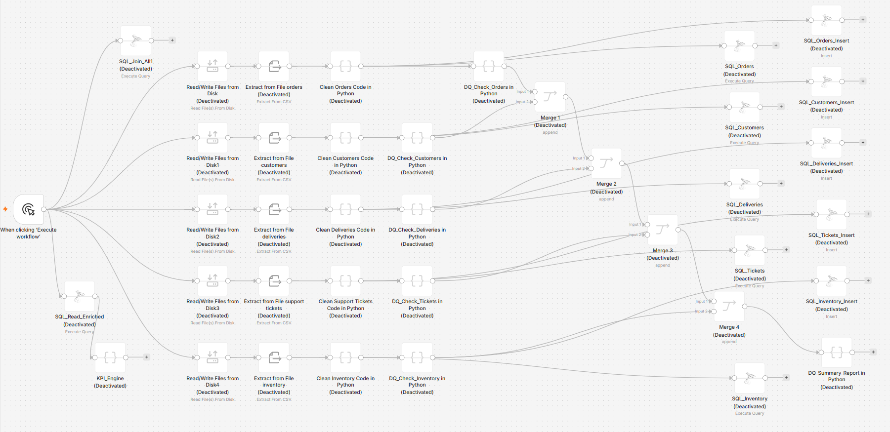
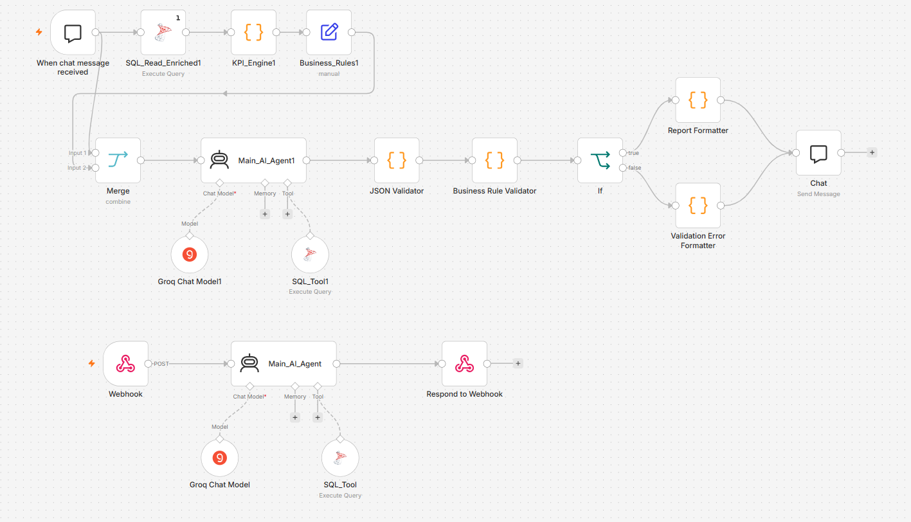
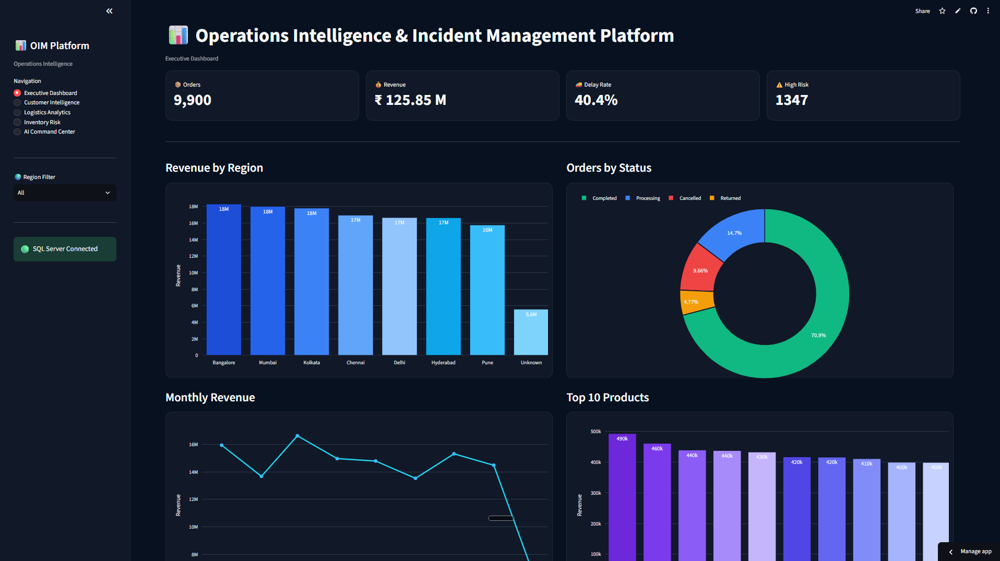

# 🤖 Operations Intelligence & Incident Management Platform

> End-to-End AI-Powered Business Intelligence Platform using **Streamlit, n8n, SQL Server, Python, Docker & Groq LLM**

[](https://operations-intelligence-incident-management-platform-vph9i3yhs.streamlit.app)

### 🌐 Live Dashboard

**https://operations-intelligence-incident-management-platform-vph9i3yhs.streamlit.app**

---

## 📌 Project Overview

This project simulates a real-world **Operations Intelligence & Incident Management** environment where business users ask natural language questions and receive executive-level operational reports generated from **live SQL Server data**.

### Example Business Questions

- Which region generated the highest revenue?
- Who are the top 10 customers by revenue?
- Which products have the highest inventory risk?
- Which carrier has the highest average delivery delay?
- Where are we losing operational efficiency?

The AI Agent automatically generates SQL, executes it on SQL Server, validates the results, and returns structured business reports through Streamlit.

---

# 🏗️ Solution Architecture

```text
Business User
      │
      ▼
Streamlit Dashboard
      │
      ▼
n8n Webhook API
      │
      ▼
Main AI Agent
 ├───────────────┐
 │               │
 ▼               ▼
Groq LLM     SQL Tool
                  │
                  ▼
          SQL Server Database
                  │
                  ▼
        JSON Validation
                  │
                  ▼
      Executive Report
```

---

# ⚙️ Tech Stack

| Layer | Technology |
|--------|------------|
| Frontend | Streamlit |
| Workflow Automation | n8n |
| Database | Microsoft SQL Server |
| Programming | Python |
| Data Processing | Pandas |
| LLM | Groq |
| Containerization | Docker |
| API | Webhook |

---

# 🔄 Workflow 1 — ETL & Data Quality Pipeline

### Objective

Build a production-style ETL pipeline that ingests multiple operational datasets, performs Python-based data cleaning and validation, loads clean tables into SQL Server, and creates the unified analytical table **`enriched_orders`**.

## ETL Pipeline

```text
Orders.csv
Customers.csv
Deliveries.csv
Support_Tickets.csv
Inventory.csv
        │
        ▼
Read Files
        │
        ▼
Extract CSV
        │
        ▼
Python Data Cleaning
        │
        ▼
Data Quality Engine
        │
        ▼
SQL Server Load
        │
        ▼
SQL Join & Enrichment
        │
        ▼
enriched_orders
```

### ETL Workflow



## Datasets

| Dataset | Rows |
|----------|-----:|
| Orders | 10,100 |
| Customers | 4,050 |
| Deliveries | 9,570 |
| Support Tickets | 5,060 |
| Inventory | 8,100 |

**Total Records Processed:** **36,880+**

## Python Data Cleaning

- Missing value handling
- Duplicate removal
- Data type conversion
- Date standardization
- Payment status normalization
- Delivery status validation
- Customer integrity checks
- Inventory consistency validation

## Data Quality Validation

Every dataset is validated before SQL loading.

**Checks include:**

- Null values
- Duplicate records
- Invalid dates
- Negative quantities
- Payment status validation
- Delivery delay validation
- Stock consistency rules

## SQL Server Warehouse

Five cleaned SQL tables are created:

| SQL Table | Source |
|-----------|--------|
| Orders | orders.csv |
| Customers | customers.csv |
| Deliveries | deliveries.csv |
| Tickets | support_tickets.csv |
| Inventory | inventory.csv |

Finally, SQL joins all tables into:

### `enriched_orders`

The analytical table powering KPI calculations and AI analytics.

---

# 🤖 Workflow 2 & 3 — Conversational AI Agent + Streamlit

The AI workflow combines **Groq LLM**, **SQL Tool**, **Business Rules**, and **Webhook API** to answer business questions from live SQL Server data.

## AI Workflow

```text
Business Question
        │
        ▼
Streamlit AI Command Center
        │
        ▼
Webhook API
        │
        ▼
Main AI Agent
   │
   ├── SQL Generator
   ├── SQL Execution
   ├── Business Rules
   ├── JSON Validator
   └── Executive Report
        │
        ▼
Business Response
```

### AI Workflow (Workflow 2 & 3)



## AI Capabilities

- Natural Language → SQL
- Live SQL Execution
- Revenue Analytics
- Customer Intelligence
- Inventory Risk Analysis
- Logistics Performance Analysis
- Root Cause Investigation
- Executive Report Generation

---

# 📊 Executive Dashboard

Interactive enterprise dashboard built with **Streamlit** and connected directly to SQL Server.



## Dashboard Modules

- 📊 Executive Dashboard
- 👥 Customer Intelligence
- 🚚 Logistics Analytics
- 📦 Inventory Risk
- 🤖 AI Command Center

## Executive KPIs

| KPI | Value |
|------|------:|
| Orders | 9,900 |
| Revenue | ₹125.85M |
| Delay Rate | 40.4% |
| High Risk Orders | 1,347 |

---

# 🧠 AI Executive Report

Every business question returns a structured executive report.


## Investigation Report Structure

- Business Question
- Problem Identified
- Evidence
- Pattern Analysis
- Root Cause
- Business Impact
- Recommended Actions

## Analytical Report Structure

- Business Question
- Executive Summary
- Evidence Table
- Business Impact
- Recommended Actions

---

# 🗄️ Database Schema

**Primary Analytical Table:** `enriched_orders`

| Category | Fields |
|----------|--------|
| Orders | order_id, order_date, quantity, order_value |
| Customer | customer_id, customer_name, customer_segment, customer_region |
| Product | product_id |
| Delivery | carrier, delivery_status, delivery_delay_days |
| Inventory | stock_available, reorder_level, daily_demand |
| Support | ticket_category, priority, sentiment |
| Finance | payment_status |

---

# 💡 Example Questions

```text
Which region generated the highest revenue?

Who are the top 10 customers by revenue?

Which products have the highest inventory risk?

Which carrier has the highest average delivery delay?

Where are we losing operational efficiency?
```

---

# ✨ Key Features

- ✅ End-to-End ETL Pipeline
- ✅ Python Data Cleaning
- ✅ Data Quality Validation Engine
- ✅ Microsoft SQL Server Integration
- ✅ SQL Join & Data Enrichment
- ✅ Conversational AI Business Analyst
- ✅ Natural Language SQL Generation
- ✅ Live SQL Query Execution
- ✅ Executive Report Generator
- ✅ Streamlit Interactive Dashboard
- ✅ REST Webhook API
- ✅ Docker Self-Hosted n8n Workflow

---

# 🚀 Getting Started

## 1. Clone Repository

```bash
git clone https://github.com/datawithsayannaha/Operations-Intelligence-Incident-Management-Platform.git

cd Operations-Intelligence-Incident-Management-Platform
```

## 2. Install Dependencies

```bash
pip install -r requirements.txt
```

## 3. Start n8n (Docker)

```bash
docker compose up -d
```

## 4. Expose n8n Webhook (Cloudflare Tunnel)

```bash
cloudflared tunnel --url http://localhost:5678
```

Copy the generated **trycloudflare.com** URL and use it as the webhook endpoint for the AI Command Center.

## 5. Run Streamlit

```bash
streamlit run app.py
```

## 6. Open Dashboard

```text
http://localhost:8501
```

---

# 👨‍💻 About Me

**Sayan Naha**

**Data Analyst • SQL • Python • Power BI • Microsoft Fabric • AI Automation**

📧 Email: snsayan2012@gmail.com
🔗 LinkedIn: https://www.linkedin.com/in/sayan-naha/
- GitHub: **@datawithsayannaha**


---
